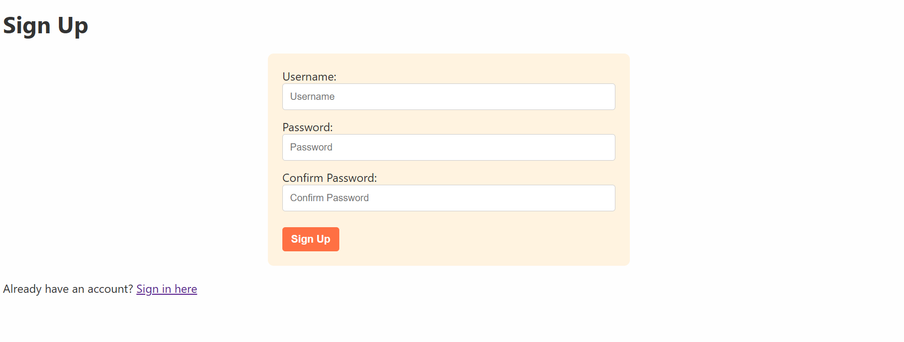
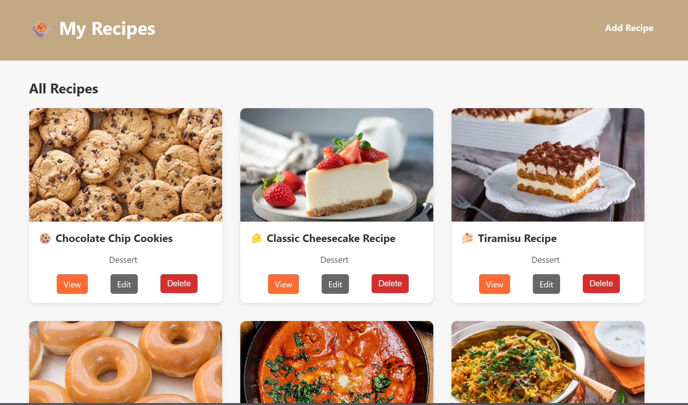
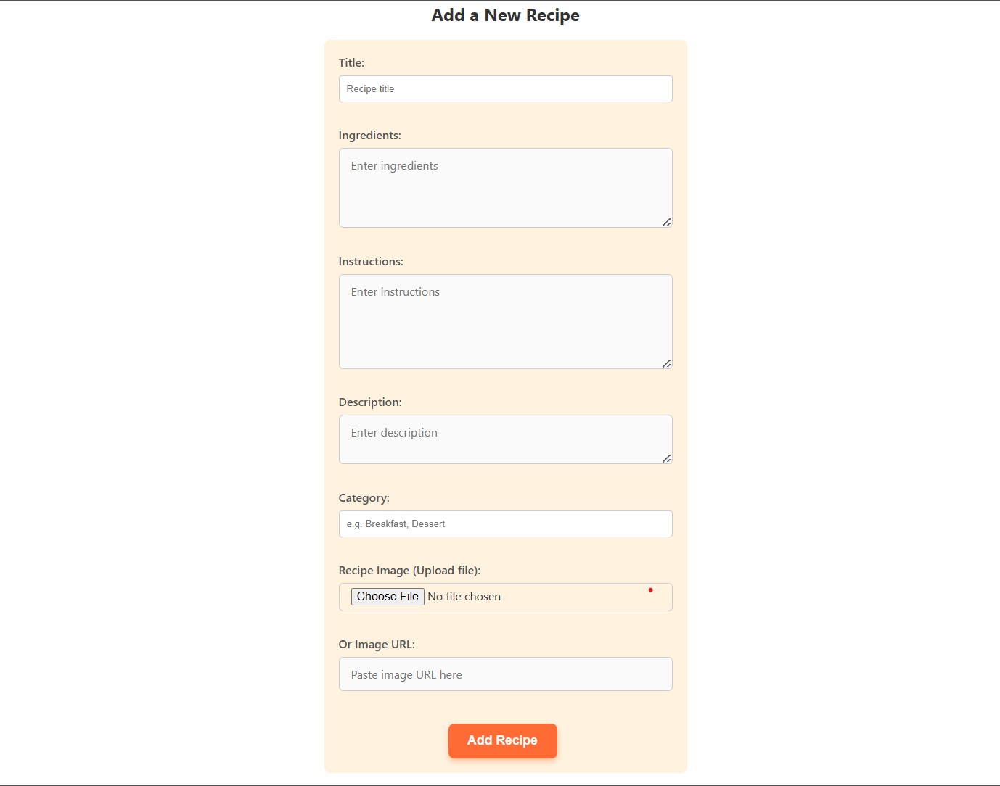
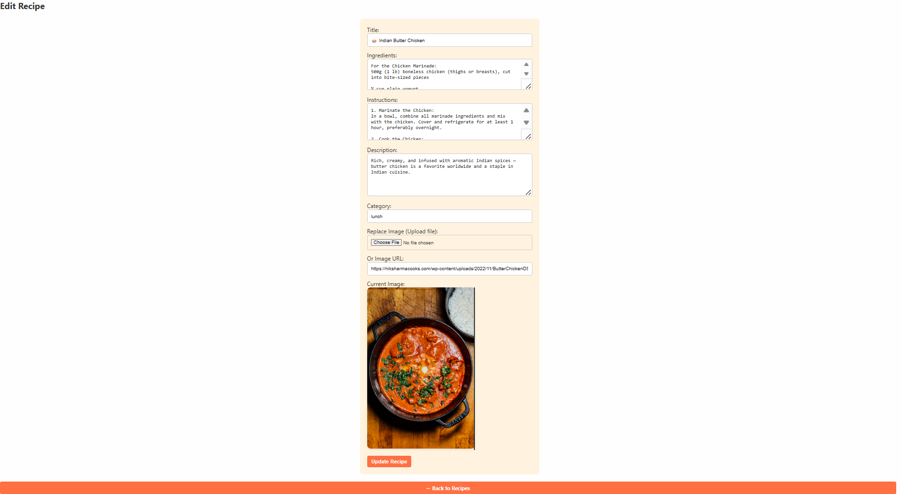

# 🍲 MyRecipeList

MyRecipeList is a full-stack Node.js and Express web application where users can create, view, edit, and delete recipes. It supports user authentication and image uploads, and uses server-side rendering with React JSX templates.

---

## 🚀 Features

- ✅ Sign Up / Sign In / Sign Out  
- ✅ Create, Read, Update, Delete (CRUD) Recipes  
- ✅ Upload images via file or URL  
- ✅ Protected routes (only logged-in users can create/edit/delete)  
- ✅ Server-rendered using React JSX (`express-react-views`)  
- ✅ MongoDB Atlas integration  

---

## 🛠️ Technologies Used

- **Backend:** Node.js, Express  
- **Templating Engine:** express-react-views (JSX)  
- **Database:** MongoDB + Mongoose  
- **Authentication:** express-session  
- **Image Uploads:** multer  
- **Styling:** Custom CSS in `/public/stylesheets`  
- **Deployment-ready** (Render, Vercel, Heroku, etc.)  

---

## 📌 Routes Table

| Method     | Route               | Description            | Access    |
| ---------- | ------------------- | ---------------------- | --------- |
| **GET**    | `/`                 | Redirect to `/recipes` | Public    |
| **GET**    | `/auth/sign-up`     | Show sign-up form      | Public    |
| **POST**   | `/auth/sign-up`     | Handle sign-up         | Public    |
| **GET**    | `/auth/sign-in`     | Show sign-in form      | Public    |
| **POST**   | `/auth/sign-in`     | Handle login           | Public    |
| **POST**   | `/auth/sign-out`    | Logout user            | Protected |
| **GET**    | `/recipes`          | List all recipes       | Public    |
| **GET**    | `/recipes/new`      | Show new recipe form   | Protected |
| **POST**   | `/recipes`          | Create new recipe      | Protected |
| **GET**    | `/recipes/:id`      | Show a single recipe   | Public    |
| **GET**    | `/recipes/:id/edit` | Show edit form         | Protected |
| **PUT**    | `/recipes/:id`      | Update a recipe        | Protected |
| **DELETE** | `/recipes/:id`      | Delete a recipe        | Protected |


---

## 📁 Project Structure

```plaintext
myrecipelist
├── config
│   ├── cloudinary.js
│   └── multer.js
├── controllers
│   ├── auth.controller.js
│   └── recipes.controller.js
├── middleware
│   ├── is-signed-in.js
│   └── pass-user-in.js
├── models
│   ├── user.js
│   └── recipe.js
├── node_modules
├── public
│   ├── stylesheets
│   │   ├── edit.css
│   │   ├── index.css
│   │   ├── new.css
│   │   ├── show.css
│   │   └── style.css
│   └── uploads
├── routes
│   ├── auth.js
│   └── recipes.js
├── views
│   ├── auth
│   │   ├── sign-in.jsx
│   │   └── sign-up.jsx
│   ├── layouts
│   │   └── Layout.jsx
│   ├── partials
│   │   ├── head.jsx
│   │   └── index.jsx
│   └── recipes
│       ├── edit.jsx
│       ├── index.jsx
│       ├── new.jsx
│       └── show.jsx
├── .env
├── .gitignore
├── app.js
├── package-lock.json
├── package.json
├── README.md
├── server.js
```
---

## 📸 Demo

## The sign-in page


## The sign-up page


## The Home page


## adding page


## The editing page



---

## Linkedin Profile
[Linkedin](https://www.linkedin.com/in/abdulrazaq-hassan-3q/)

## Github Profile
[Github](https://github.com/3Razaq)